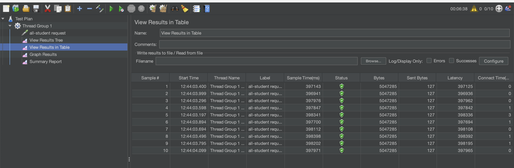
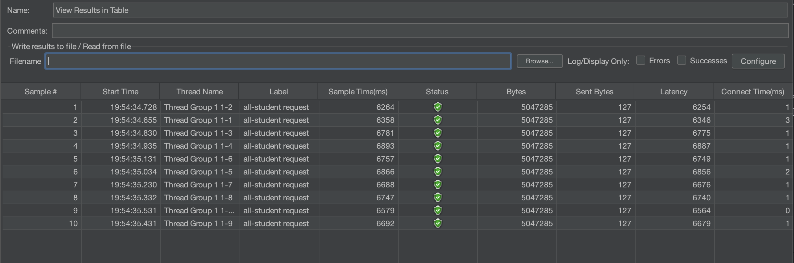
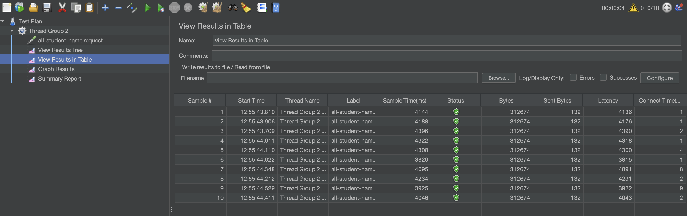
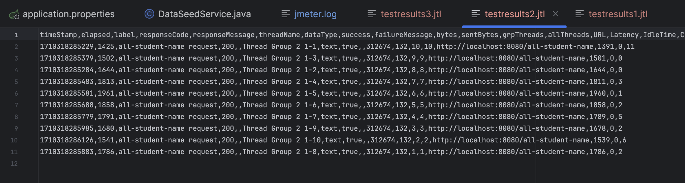
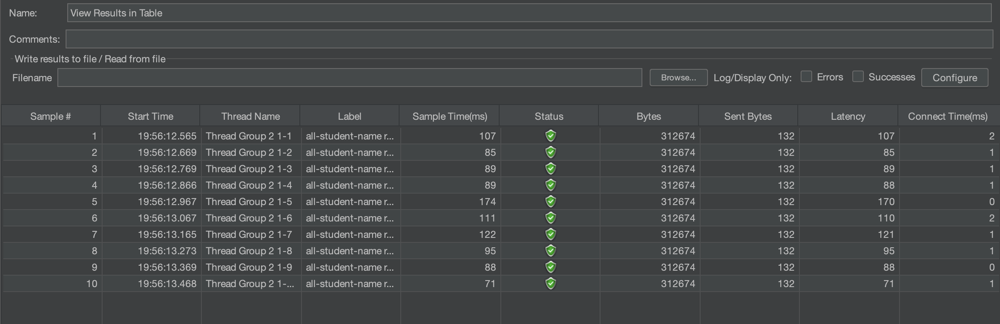
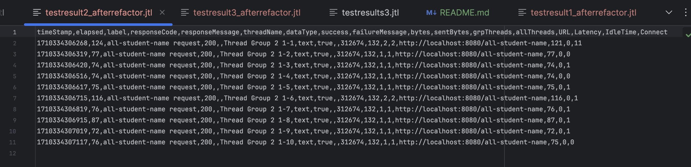
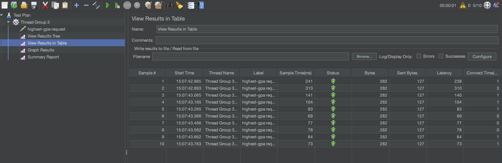
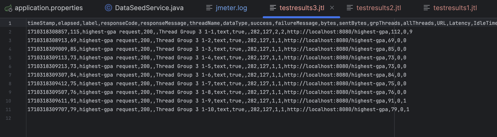
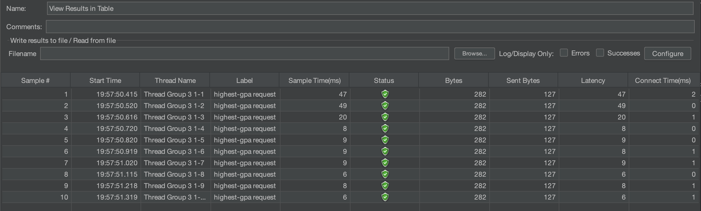
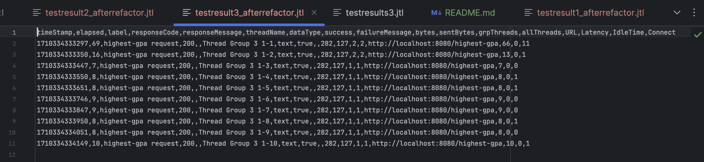

### Nama: Febrian Irvansyah
### NPM: 2206083584
### Kelas: Pemrograman Lanjut C

## Screenshots
### all-student request before

## all-student request after

[cli all student request cli](pics/cli-all-student-after.png)

## all-student-name request before

## all-student-name request after

## highest-gpa request before

## highest-gpa request after

## Kesimpulan: 
Terdapat improvement setelah melakukan optimisasi pada method yang digunakan. Hal tersebut terlihat jelas melalui elapsed time yang diperlukan untuk menjalankan program

## REFLEKSI

### 1. What is the difference between the approach of performance testing with JMeter and profiling with IntelliJ Profiler in the context of optimizing application performance?
Jmeter melakukan perhitungan terhadap kinerja overall keseluruhan program untuk melakukan sebuah task. Berbeda dengan Profiler yang memiliki kemampuan untuk melihat secara spesifik titik-titik dijalankannya program. Dengan profiler maka dapta diketahui bagian mana yang menjadi beban terbesar.

### 2. How does the profiling process help you in identifying and understanding the weak points in your application?
Pada profiling terdapat beberapa hal yang termonitor pada program seperti CPU usage, thread activity, dan method profiling. Dengan adanya fitur tersebut, profiler dapat memberikan data mengenai segmentasi kode mana yang memberatkan proses komputasi pada komputer. Contohnya adalah memberi tahu berapa lama waktu eksekusi pada suatu method. Dengan ini, programmer dapat secara efisien mengoptimalkan kodenya tanpa perlu menebak bagian mana yang kurang optimal.

### 3. Do you think IntelliJ Profiler is effective in assisting you to analyze and identify bottlenecks in your application code?
Sangat efektif, dengan adanya profiler programmer dapat melihat secara langsung bagaimana suatu segmen kode berpengaruh pada keseluruhan program. Selain itu, dengan adanya profiling kita dapat membandingkan bagaimana hasil sebelum dan sesudah pengoptimalan untuk mengetahui apakah optimalisasi sudah sesuai target. Selain itu juga profiling dapat memberi tahu programmer bagaimana waktu dan cpu usage program terhadap waktu yang sangat berguna bagi programmer.

### 4. What are the main challenges you face when conducting performance testing and profiling, and how do you overcome these challenges?
Tantangan terbesar adalah menentukan method mana yang sebaiknya dilakukan refactoring serta bagaimana refactoring dilakukan. Hal tersebut dirasa sulit karena terdapat beberapa method yang mungkin memiliki eksekusi waktu yang lama relatif dengan segmen kode lainnya, namun sebenarnya sudah optimal. Selain itu, kesulitan dalam menentukan bagaimana refactoring harus dilakukan karena diperlukan pengalaman yang cukup banyak untuk terbiasa. Saya mengatasi dengan melakukan analisis Big O untuk dilakukan minimalisasi yang biasanya ditemukan pada nested loop.

### 5. What are the main benefits you gain from using IntelliJ Profiler for profiling your application code?
Dapat melakukan profiling tanpa software tambahan. Selain itu dapat melakukan profiling secara detail karena fitur yang sudah dikembangkan dengan sangat baik.

### 6. How do you handle situations where the results from profiling with Inte	lliJ Profiler are not entirely consistent with findings from performance testing using JMeter?
Dengan cara mengkorelasikan hubungan hasil profiling dengan Jmeter untuk melihat bagian mana yang saling mempengaruhi. Hal tersebut dapat terjadi karena perbedaan pengetesan. Selain itu perlu juga untuk mengidentifikasi banyak kondisi testing.

### 7. What strategies do you implement in optimizing application code after analyzing results from performance testing and profiling? How do you ensure the changes you make do not affect the application's functionality?
Dengan cara mengidentifikasi bottleneck yang terjadi. Melihat bagian kode mana yang relatif menghabiskan waktu lebih banyak dari lainnya. Selain itu identifikasi juga  hal hal sederhana yang mungkin menghabiskan waktu seperti nested loop. Untuk memastikan refactoring tidak mengubah fungsionalitas maka akan dilakukan testing agar program tetep konsisten. selain itu dilakukan code review dengan rekan programmer.